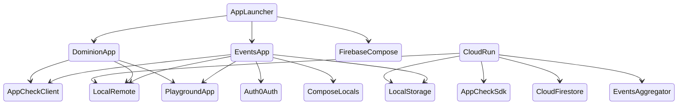

# 🧪 Playground 

# Warning
None of this is up to date, I'm working on automating documentation, please stand by.

## Projects

<table>
    <tr>
        <td>
            <h3>Cloud Run [cloud-run]</h3>
            
            
        </td>
        <td>
            <h3>Dominion App [dominion-app]</h3>
            
            
            
        </td>
        <td>
            <h3>Events App [events-app]</h3>
            
            
            
            
Original multiplatform application to demonstrate the capabilities of the included Kotlin libraries and tools.

            
Formerly exclusively for Android, but now configured for Desktop application, and iOS soon to follow.

            
Application purpose is to view upcoming Android conferences, and allow collecting of virtual lanyards.

        </td>
    </tr>
</table>

## Structure

## Modules

### App-Check [app-check]

Implements a custom app-check provider for multiplatform applications to verify client applications.  
https://firebase.google.com/docs/app-check/custom-provider

### Auth Oauth [auth-oauth]

### Build Plugins [build-plugins]

### Kotlin GB [kotlin-gb]

### Local Storage [local-storage]

### Notion Console [notion-console]

### Notion Import [notion-import]

### Playground App [playground-app]
  

## Talks
- Droidcon Berlin 2022
- Droidcon NYC 2019
- Droidcon Berlin 2018

## Releases

- [Droidcon NYC 2019: Implementing the Paging Library](https://github.com/ashdavies/playground/releases/tag/v3.0)
- [Droidcon Berlin 2018: Leveraging Android Data Binding with Kotlin](https://github.com/ashdavies/playground/releases/tag/v2.0)
- [Android Data Binding Beta: Sample](https://github.com/ashdavies/playground/releases/tag/v1.0)
